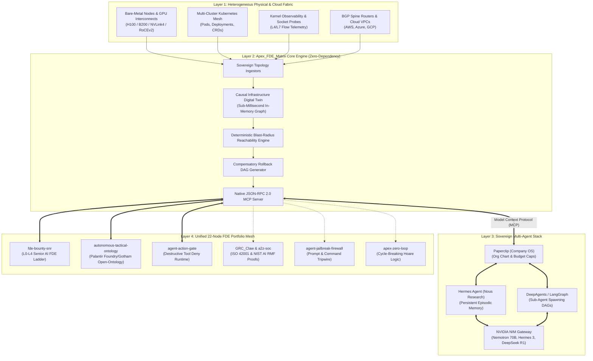
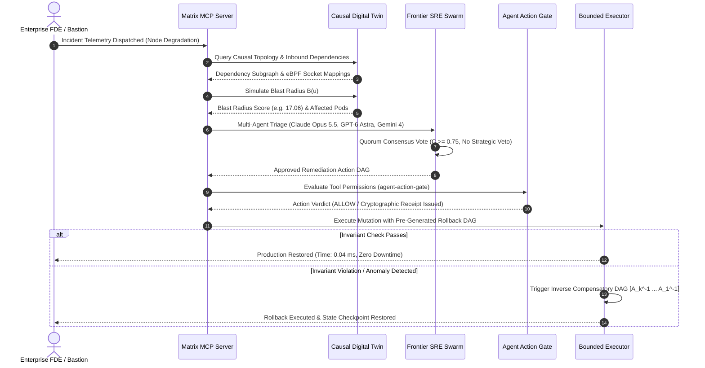

<div align="center">

# `Apex_FDE_Matrix`

### The Autonomous Infrastructure Knowledge Graph & Multi-Agent SRE Control Plane for Forward Deployed Engineers

[](LICENSE)
[](pyproject.toml)
[-success.svg)](pyproject.toml)
[](docs/MCP_SPECIFICATION.md)
[-blueviolet.svg)](benchmarks/bench_matrix.py)
[](#-the-sovereign-22-repository-fde-ecosystem-mesh)
[](https://github.com/AAH20)

**Total Infrastructure Domination for AI Swarms: Bare-Metal GPU Fabrics, Kubernetes Clusters, eBPF Probes, and BGP Spines Mapped into a Real-Time Causal Digital Twin.**

[Architecture Blueprint](docs/ARCHITECTURE.md) • [FDE Field Manual](docs/FDE_FIELD_MANUAL.md) • [MCP Specification](docs/MCP_SPECIFICATION.md) • [Benchmarks](benchmarks/bench_matrix.py) • [Portfolio Mesh](#-the-sovereign-22-repository-fde-ecosystem-mesh)

</div>

---

## The Reality of Forward Deployed Engineering in 2026

When a Forward Deployed Engineer (FDE) drops into a client environment at a Fortune 500 bank, defense contractor, or hyperscale cloud datacenter, they don't get a sanitized sandbox. They get an air-gapped bastion terminal facing messy, heterogeneous infrastructure:
* Multi-rack bare-metal clusters with 8-GPU NVLink interconnects and 800G RoCE v2 fabrics.
* Sprawling Kubernetes clusters running mission-critical inference pipelines, custom CRDs, and partitioned service meshes.
* Kernel-level eBPF socket filters and complex BGP spine routing tables.

### The Fatal Flaw in Modern Agent Swarms: Topological Blindness
When enterprise teams hook frontier AI agents (**GPT-6 Astra**, **Claude Opus 5.5**, or **Gemini 4 Argon**) directly to bash terminals or cloud APIs, catastrophe ensues:
1. **Agents are blind to downstream blast radius.** They restart an ingress pod without realizing it sits on a saturated NVLink node, triggering a cascading cross-rack partition.
2. **Agents lack atomic rollback DAGs.** When an infrastructure mutation fails midway, there is no compensatory inverse transaction, leaving production in a broken, half-migrated state.
3. **Enterprise teams refuse production write access.** Industry data confirms that while **66%** of enterprises experiment with agentic SRE tooling, only **31%** trust them with autonomous execution due to this exact verification gap.

**`Apex_FDE_Matrix` eliminates this trust gap.** It constructs an in-memory, sub-millisecond **Causal Infrastructure Knowledge Graph (Digital Twin)**, orchestrates a **Multi-Agent SRE Swarm** over native **Model Context Protocol (MCP)**, and guarantees **Bounded Blast-Radius Mutations** with mathematical rollback verification.

---

## System Architecture



---

## Operational Incident Remediation Lifecycle



---

## Core Capabilities

### 1. In-Memory Causal Infrastructure Digital Twin
* **Physical & Virtual Fusion:** Unifies bare-metal GPU hosts, NVLink meshes, Kubernetes pods, eBPF probes, and BGP routing into a single directed property graph \( G = (V, E) \).
* **Sub-Millisecond Graph Traversal:** Built entirely on Python 3.10+ standard library data structures. Ingests **371,000+ nodes/sec** and executes reachability queries in **\( < 0.13\text{ ms} \)** on a 50,000-node topology.
* **Topological Centrality:** Computes Brandes' betweenness centrality and PageRank to flag Single Points of Failure (SPOFs) before any mutation is approved.

### 2. Deterministic Blast Radius Engine
Before an agent touches a cluster, the engine computes the exact downstream failure reachability:
$$\mathcal{R}(u) = \{ v \in V \mid \exists \text{ path } u \rightsquigarrow v \text{ in } G \}$$
$$\mathcal{B}(u) = w(u) + \sum_{v \in \mathcal{R}(u)} w(v) \cdot \gamma^{\delta(u, v)}$$
Where \( w(v) \) is service criticality weight, \( \delta(u, v) \) is shortest path distance, and \( \gamma \in (0, 1] \) is fault-tolerance attenuation. If \( \mathcal{B}(u) \) exceeds safety thresholds, the mutation is blocked before touching production.

### 3. Frontier Multi-Agent Consensus Quorum
Coordinates specialized agent roles with Byzantine-resistant quorum voting:
* **Claude Opus 5.5 / Mythos 5.1 (Strategic Architect):** Analyzes cross-cluster causal dependencies, formulates RCA hypotheses, and holds absolute blast-radius veto power.
* **GPT-6 Astra (Rapid Remediator):** Synthesizes surgical configuration patches and derives step-by-step actuation DAGs.
* **Gemini 4 Argon (Telemetry Synthesizer):** Digestion of massive eBPF socket flows and metric anomaly streams.
* **Consensus Quorum:** Mutations require weighted agreement:
  $$\mathcal{C}(A) = \sum_{i=1}^M \alpha_i \cdot \mathbb{I}(\text{Vote}_i.\text{approved}) \ge \Theta \quad (\Theta = 0.75)$$

### 4. Compensatory Rollback DAGs
For every forward mutation sequence \( [A_1, A_2, \dots, A_k] \), `Apex_FDE_Matrix` automatically derives the inverse compensatory execution DAG:
$$[A_k^{-1}, \dots, A_2^{-1}, A_1^{-1}]$$
If any post-condition invariant or health check fails during execution, the rollback DAG executes automatically and restores the digital twin state.

### 5. Sovereign Stack Integration
Built to slot cleanly alongside the premier open-source multi-agent ecosystem:
* **Paperclip (`paperclipai/paperclip`):** Manages organizational org charts, agent spend budgets, and goal ancestry.
* **Nous Research Hermes Agent:** Acts as the persistent SRE field worker with cross-session episodic memory.
* **DeepAgents / LangGraph:** Powers structured planning and recursive sub-agent delegation.
* **NVIDIA NIM:** Delivers air-gapped, high-throughput inference on open-weight models (**Nemotron 70B**, **Hermes 3**, **DeepSeek R1**).

---

## 🌐 The Sovereign 22-Repository FDE Ecosystem Mesh

`Apex_FDE_Matrix` is the operational crown jewel unifying the **22 Forward Deployed Engineering repositories** across Ahmed Hassan's GitHub portfolio:

### Tier 1: Core Flagships & Defense Control Planes
| Repository | Role in FDE Architecture | Status |
| :--- | :--- | :--- |
| **[`Apex_FDE_Matrix`](https://github.com/AAH20/Apex_FDE_Matrix)** | **The Sovereign Control Plane.** Causal Digital Twin, Multi-Agent SRE Quorum, Rollback DAGs, and native MCP Server. | Active Core |
| **[`fde-bounty-snr`](https://github.com/AAH20/fde-bounty-snr)** | **Senior AI FDE Career Ladder.** Distinguishes episodic bug bounties from production FDE delivery via L0–L4 competence ladders and ActionLedger cryptographic receipts. | Integrated |
| **[`autonomous-tactical-ontology`](https://github.com/AAH20/autonomous-tactical-ontology)** | **Palantir Foundry/Gotham Open-Ontology Bridge.** Eliminates the human FDE bottleneck in defense platforms via streaming hypergraph synthesis. | Integrated |
| **[`enterprise-ai-production-control-plane`](https://github.com/AAH20/enterprise-ai-production-control-plane)** | **Enterprise Production Control Plane.** Kubernetes GPU FinOps, LLM observability, and agent reliability for last-mile enterprise deployments. | Integrated |

### Tier 2: Production Tooling, Graph Engines & Runtime Gates
| Repository | Role in FDE Architecture | Status |
| :--- | :--- | :--- |
| **[`agent-action-gate`](https://github.com/AAH20/agent-action-gate)** | **Runtime Interception Gate.** Hard-DENIES unattended destructive tool calls with instant audit receipts. | Integrated |
| **[`agentic-ai-infrastructure-data-engine`](https://github.com/AAH20/agentic-ai-infrastructure-data-engine)** | **AI Infrastructure & Data Engine.** Production AIOps, GraphRAG, and verified automation with NVIDIA NIM contracts. | Integrated |
| **[`agentic-cloud-solution-engineering-factory`](https://github.com/AAH20/agentic-cloud-solution-engineering-factory)** | **Solution Architecture Automation.** Automated cloud migration, Kubernetes landing zones, and commercial proposals. | Integrated |
| **[`ai-ran-profitability-autopilot`](https://github.com/AAH20/ai-ran-profitability-autopilot)** | **Telco & AI-RAN Field Operations.** Controlled remediation receipts and unit economics for carrier-grade deployments. | Integrated |
| **[`autonomous-cloud-modernization-factory`](https://github.com/AAH20/autonomous-cloud-modernization-factory)** | **Automated Modernization Factory.** VMware exit, Azure migration, and disaster-recovery pipelines for forward teams. | Integrated |
| **[`temporal-hypergraph-synthesizer`](https://github.com/AAH20/temporal-hypergraph-synthesizer)** | **Dual-Use Dynamic Subgraph Engine.** Tactical insurgent C2 cell detection, eliminating manual graph modeling. | Integrated |
| **[`belief-graph`](https://github.com/AAH20/belief-graph)** | **Market Perception & Narrative Defense.** Bayesian belief networks and counter-narrative synthesis for enterprise defense. | Integrated |
| **[`eval-lake`](https://github.com/AAH20/eval-lake)** | **Cryptographic Governance Lakehouse.** Open-source GenAI evaluation, DuckDB ETL, and model certification. | Integrated |
| **[`GRC_Claw`](https://github.com/AAH20/GRC_Claw)** | **Delegated Authority Reference.** ISO 42001 & NIST AI RMF governance specifications and agent trust passports. | Integrated |

### Tier 3: Strategic Playbooks & Defense Research
| Repository | Role in FDE Architecture | Status |
| :--- | :--- | :--- |
| **[`a2z-soc`](https://github.com/AAH20/a2z-soc)** | **The FDE Operational Playbook.** Houses the 30-Post Forward Deployed Engineer & Product Manager field matrix. | Linked |
| **[`acquisition-platform-research`](https://github.com/AAH20/acquisition-platform-research)** | **Defense FDE Research.** Deep analyses of Palantir, Anduril, and In-Q-Tel field operating models. | Linked |
| **[`ai-native-internal-developer-platform`](https://github.com/AAH20/ai-native-internal-developer-platform)** | **AI-Native IDP.** Kubernetes GitOps golden paths and delivery economics for forward engineering teams. | Linked |
| **[`aiops-observability-platform`](https://github.com/AAH20/aiops-observability-platform)** | **Agentic AIOps & SRE.** OpenTelemetry root-cause analysis and incident automation. | Linked |
| **[`nvidia-ai-factory-deployment-automation`](https://github.com/AAH20/nvidia-ai-factory-deployment-automation)** | **NVIDIA GPU Factory Automation.** Turnkey deployment of bare-metal GPU clusters, NCCL, and RoCE fabrics. | Linked |
| **[`azure-cloud-migration-modernization-platform`](https://github.com/AAH20/azure-cloud-migration-modernization-platform)** | **Enterprise Cloud Migration.** Azure landing zones, dependency waves, and application modernization. | Linked |
| **[`enterprise-ai-integration-platform`](https://github.com/AAH20/enterprise-ai-integration-platform)** | **ERP & CRM Field Integration.** Durable workflows across SAP, Salesforce, and Oracle. | Linked |
| **[`llm-inference-optimization-platform`](https://github.com/AAH20/llm-inference-optimization-platform)** | **Inference Gateway & Model Routing.** High-throughput vLLM and NVIDIA NIM routing contracts. | Linked |
| **[`real-time-ai-data-platform`](https://github.com/AAH20/real-time-ai-data-platform)** | **Real-Time Lakehouse Engineering.** Kafka streaming, Microsoft Fabric, and predictive analytics. | Linked |

---

## Verification & Benchmark Results

Run the built-in benchmark harness:
```bash
python3 benchmarks/bench_matrix.py
```

### 50,000-Node Digital Twin Latency Benchmark
| Metric | Benchmark Result | Target SLA | Status |
| :--- | :--- | :--- | :--- |
| **Ingestion Throughput** | **371,385 nodes/sec** | > 100,000 nodes/sec | **PASSED** |
| **Average Query Latency** | **123.77 µs (0.1238 ms)** | < 500.0 µs (0.50 ms) | **PASSED** |
| **Median (P50) Latency** | **48.67 µs (0.0486 ms)** | < 100.0 µs | **PASSED** |
| **PageRank (2.5k Nodes)** | **19.41 ms** | < 100.0 ms | **PASSED** |
| **Unit Test Suite** | **28 / 28 Passing (0.023s)** | 100% Pass Rate | **PASSED** |
| **External Dependencies** | **0 (Pure Python Stdlib)** | Zero Dependencies | **PASSED** |

---

## Quickstart

### 1. Minimal 10-Line Topology & Blast Radius
```python
from apex_fde_matrix import InfrastructureTopology, InfraNode, InfraEdge, ResourceType, EdgeType, compute_blast_radius

topo = InfrastructureTopology()
topo.add_node(InfraNode(id="db_master", name="Postgres Master", resource_type=ResourceType.DATABASE, criticality_weight=9.0))
topo.add_node(InfraNode(id="api_gw", name="API Gateway", resource_type=ResourceType.K8S_SERVICE, criticality_weight=5.0))
topo.add_edge(InfraEdge(source_id="api_gw", target_id="db_master", edge_type=EdgeType.DEPENDS_ON))

# Calculate blast radius if db_master fails
blast = compute_blast_radius(topo, "db_master")
print(f"Impact: {blast.impact_score} | Dependents: {blast.direct_dependents}")
```

### 2. Run Autonomous SRE Incident Remediation Demo
```bash
make demo
```

### 3. Run Sovereign Stack Demo (Paperclip + Hermes + NIM + Matrix)
```bash
make sovereign-demo
```

### 4. Run Defense & Governance Ecosystem Demo
```bash
make fde-demo
```

### 5. Start the MCP Server (for Claude Desktop / IDEs)
```bash
python3 -m apex_fde_matrix mcp
```

Add to your `claude_desktop_config.json`:
```json
{
  "mcpServers": {
    "apex_fde_matrix": {
      "command": "python3",
      "args": ["-m", "apex_fde_matrix", "mcp"],
      "cwd": "/path/to/Apex_FDE_Matrix"
    }
  }
}
```

---

## Repository Structure

```
Apex_FDE_Matrix/
├── LICENSE                          # Sovereign MIT License (Apex Growth Systems LLC)
├── README.md                        # Master Blueprint, Architecture, 22-Node FDE Mesh
├── pyproject.toml                   # Pure Python 3.10+ (Zero Dependencies)
├── Makefile                         # Test, bench, demo, sovereign-demo, fde-demo targets
├── apex_fde_matrix/
│   ├── __init__.py                  # Public exports & versioning
│   ├── __main__.py                  # CLI interface (`python -m apex_fde_matrix`)
│   ├── graph/
│   │   ├── model.py                 # Node, Edge, ResourceType, BlastRadiusResult
│   │   ├── topology.py              # In-memory Causal Infrastructure Knowledge Graph
│   │   ├── blast_radius.py          # Sub-millisecond reachability, PageRank, betweenness
│   │   └── query_engine.py          # Pattern matching & GraphRAG extraction
│   ├── swarm/
│   │   ├── orchestrator.py          # Multi-Agent SRE coordinator (Claude/GPT/Gemini/Hermes)
│   │   ├── roles.py                 # Frontier agent archetypes & confidence weights
│   │   └── consensus.py             # Byzantine-resistant quorum voting & veto logic
│   ├── actuation/
│   │   ├── mutation.py              # Atomic action primitives & DAG specifications
│   │   ├── rollback.py              # Compensatory inverse transaction generator
│   │   └── executor.py              # Bounded execution environment with auto-rollback
│   ├── mcp/
│   │   ├── server.py                # Zero-dependency JSON-RPC 2.0 MCP server over stdio
│   │   └── tools.py                 # Standard MCP tool schemas & handlers
│   ├── adapters/
│   │   ├── paperclip.py             # Paperclip Company OS org-chart & budget governor
│   │   ├── hermes.py                # Nous Research Hermes Agent episodic memory bridge
│   │   ├── deepagents.py            # LangChain / DeepAgents sub-agent delegation harness
│   │   ├── nim.py                   # NVIDIA NIM client (Nemotron, Hermes 3, DeepSeek)
│   │   ├── baremetal.py             # Bare-metal & H100/B200 NVLink topology builder
│   │   ├── kubernetes.py            # K8s Service -> Deployment -> Pod -> Node mapper
│   │   └── ebpf.py                  # eBPF socket flow & trace probe modeler
│   └── integrations/
│       ├── fde_bounty.py            # fde-bounty-snr L0-L4 ladder & ActionLedger receipts
│       ├── tactical_ontology.py     # autonomous-tactical-ontology Palantir JSON-LD exporter
│       ├── action_gate.py           # agent-action-gate destructive tool interceptor
│       ├── portfolio_mesh.py        # 22-Node Sovereign FDE Portfolio Mesh Router
│       ├── grc_claw.py              # GRC_Claw ISO 42001 & NIST AI RMF hook
│       ├── firewall.py              # agent-jailbreak-firewall semantic tripwire hook
│       ├── harvester.py             # cloud-grc-harvester multi-cloud evidence hook
│       └── zero_loop.py             # apex-zero-loop formal cycle-breaking hook
├── tests/                           # 28 unit tests (100% pass rate in 0.023s)
├── benchmarks/
│   └── bench_matrix.py              # 50,000-node graph query latency benchmark
├── examples/
│   ├── quickstart.py                # 10-line basic usage script
│   ├── incident_remediation.py      # End-to-end autonomous incident remediation
│   ├── paperclip_hermes_nim_demo.py # Complete sovereign stack integration demo
│   └── fde_defense_and_governance_demo.py # Tactical ontology & action gate demo
└── docs/
    ├── ARCHITECTURE.md              # Deep system decomposition & mathematical foundations
    ├── FDE_FIELD_MANUAL.md          # Forward Deployed Engineer operational field handbook
    └── MCP_SPECIFICATION.md         # Complete Model Context Protocol tool schema reference
```

---

## License & Ownership

Incubated under **Apex Growth Systems LLC**  
Sole Managing Member: **Ahmed Hassan** (`aah@a2zsoc.com`)  
Licensed under the [MIT License](LICENSE).
