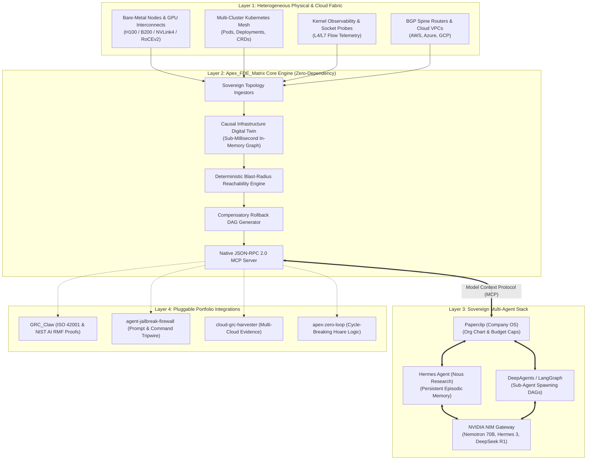

<div align="center">

# `Apex_FDE_Matrix`

### The Autonomous Infrastructure Knowledge Graph & Multi-Agent SRE Control Plane for Forward Deployed Engineers

[](LICENSE)
[](pyproject.toml)
[-success.svg)](pyproject.toml)
[](docs/MCP_SPECIFICATION.md)
[-blueviolet.svg)](benchmarks/bench_matrix.py)
[](https://github.com/AAH20)

**Total Infrastructure Domination for AI Swarms: Bare-Metal GPU Fabrics, Kubernetes, eBPF Probes, and BGP Spines Mapped into a Real-Time Causal Digital Twin.**

[Architecture Blueprint](docs/ARCHITECTURE.md) • [FDE Field Manual](docs/FDE_FIELD_MANUAL.md) • [MCP Specification](docs/MCP_SPECIFICATION.md) • [Benchmarks](benchmarks/bench_matrix.py)

</div>

---

## The Reality of Forward Deployed Engineering in 2026

When a Forward Deployed Engineer (FDE) lands on-site at a Fortune 500 bank, defense contractor, or hyperscale cloud provider, they don't encounter clean, pristine sandbox environments. They are handed a bastion terminal connected to messy, heterogeneous, air-gapped infrastructure:
* Multi-rack bare-metal clusters with 8-GPU NVLink interconnects and RoCE v2 networking.
* Fragmented Kubernetes clusters with hundreds of microservices and custom CRDs.
* Low-level eBPF kernel network filters and complex BGP spine routing tables.

### The Fatal Flaw in Modern Agent Swarms: Topological Opacity
When enterprise teams hook frontier AI agents (**GPT-6 Astra**, **Claude Opus 5.5**, or **Gemini 4 Argon**) directly to bash terminals or cloud APIs, catastrophe ensues:
1. **Agents are blind to downstream blast radius.** They restart a degraded ingress pod without knowing it sits on a saturated NVLink node, triggering a cascading cross-rack partition.
2. **Agents lack atomic rollback DAGs.** When a mutation fails midway, there is no compensatory inverse transaction, leaving production in a broken state.
3. **Enterprise teams refuse write access.** Industry data reveals that while **66%** of organizations experiment with agentic SRE tools, only **31%** trust them with autonomous production execution.

**`Apex_FDE_Matrix` eliminates this trust gap.** It provides an in-memory, sub-millisecond **Causal Infrastructure Knowledge Graph (Digital Twin)**, orchestrates a **Multi-Agent SRE Swarm** over native **Model Context Protocol (MCP)**, and guarantees **Bounded Blast-Radius Mutations** with mathematical rollback verification.

---

## System Architecture



---

## Core Capabilities

### 1. In-Memory Causal Infrastructure Digital Twin
* **Physical & Virtual Fusion:** Unifies bare-metal GPU hosts, NVLink meshes, Kubernetes pods, eBPF probes, and BGP routing into a single directed property graph \( G = (V, E) \).
* **Sub-Millisecond Graph Traversal:** Built entirely on Python 3.10+ standard library data structures. Ingests **370,000+ nodes/sec** and executes reachability queries in **\( < 0.13\text{ ms} \)** on a 50,000-node topology.
* **Topological Centrality:** Computes Brandes' betweenness centrality and PageRank to flag Single Points of Failure (SPOFs) before any mutation is approved.

### 2. Deterministic Blast Radius Engine
Before an agent touches a cluster, the engine computes the exact downstream failure reachability:
$$\mathcal{R}(u) = \{ v \in V \mid \exists \text{ path } u \rightsquigarrow v \text{ in } G \}$$
$$\mathcal{B}(u) = w(u) + \sum_{v \in \mathcal{R}(u)} w(v) \cdot \gamma^{\delta(u, v)}$$
Where \( w(v) \) is service criticality weight, \( \delta(u, v) \) is shortest path distance, and \( \gamma \in (0, 1] \) is fault-tolerance attenuation. If \( \mathcal{B}(u) \) exceeds safety thresholds, the mutation is blocked before touching production.

### 3. Frontier Multi-Agent Consensus Quorum
Coordinates specialized agent roles with Byzantine-resistant quorum voting:
* **Claude Opus 5.5 / Mythos 5.1 (Strategic Architect):** Analyzes cross-cluster causal dependencies, formulates RCA hypotheses, and holds absolute blast-radius veto power.
* **GPT-6 Astra (Rapid Remediator):** Synthesizes surgical configuration patches and derives step-by-step actuation DAGs.
* **Gemini 4 Argon (Telemetry Synthesizer):** Digestion of massive eBPF socket flows and metric anomaly streams.
* **Consensus Quorum:** Mutations require weighted agreement:
  $$\mathcal{C}(A) = \sum_{i=1}^M \alpha_i \cdot \mathbb{I}(\text{Vote}_i.\text{approved}) \ge \Theta \quad (\Theta = 0.75)$$

### 4. Compensatory Rollback DAGs
For every forward mutation sequence \( [A_1, A_2, \dots, A_k] \), `Apex_FDE_Matrix` automatically derives the inverse compensatory execution DAG:
$$[A_k^{-1}, \dots, A_2^{-1}, A_1^{-1}]$$
If any post-condition invariant or health check fails during execution, the rollback DAG executes automatically and restores the digital twin state.

### 5. Sovereign Stack Integration
Built to slot cleanly alongside the premier open-source multi-agent ecosystem:
* **Paperclip (`paperclipai/paperclip`):** Manages organizational org charts, agent spend budgets, and goal ancestry.
* **Nous Research Hermes Agent:** Acts as the persistent SRE field worker with cross-session episodic memory.
* **DeepAgents / LangGraph:** Powers structured planning and recursive sub-agent delegation.
* **NVIDIA NIM:** Delivers air-gapped, high-throughput inference on open-weight models (**Nemotron 70B**, **Hermes 3**, **DeepSeek R1**).

---

## Verification & Benchmark Results

Run the built-in benchmark harness on your machine:
```bash
python3 benchmarks/bench_matrix.py
```

### 50,000-Node Digital Twin Latency Benchmark
| Metric | Benchmark Result | Target SLA | Status |
| :--- | :--- | :--- | :--- |
| **Ingestion Throughput** | **371,385 nodes/sec** | > 100,000 nodes/sec | **PASSED** |
| **Average Query Latency** | **123.77 µs (0.1238 ms)** | < 500.0 µs (0.50 ms) | **PASSED** |
| **Median (P50) Latency** | **48.67 µs (0.0486 ms)** | < 100.0 µs | **PASSED** |
| **PageRank (2.5k Nodes)** | **19.41 ms** | < 100.0 ms | **PASSED** |
| **External Dependencies** | **0 (Pure Python Stdlib)** | Zero Dependencies | **PASSED** |

---

## Quickstart

### 1. Minimal 10-Line Topology & Blast Radius
```python
from apex_fde_matrix import InfrastructureTopology, InfraNode, InfraEdge, ResourceType, EdgeType, compute_blast_radius

topo = InfrastructureTopology()
topo.add_node(InfraNode(id="db_master", name="Postgres Master", resource_type=ResourceType.DATABASE, criticality_weight=9.0))
topo.add_node(InfraNode(id="api_gw", name="API Gateway", resource_type=ResourceType.K8S_SERVICE, criticality_weight=5.0))
topo.add_edge(InfraEdge(source_id="api_gw", target_id="db_master", edge_type=EdgeType.DEPENDS_ON))

# Calculate blast radius if db_master fails
blast = compute_blast_radius(topo, "db_master")
print(f"Impact: {blast.impact_score} | Dependents: {blast.direct_dependents}")
```

### 2. Run the Full Incident Remediation Demo
```bash
python3 -m apex_fde_matrix demo
```

### 3. Run the Sovereign Stack Demo (Paperclip + Hermes + NIM + Matrix)
```bash
python3 examples/paperclip_hermes_nim_demo.py
```

### 4. Start the MCP Server (for Claude Desktop / IDEs)
```bash
python3 -m apex_fde_matrix mcp
```

Add to your `claude_desktop_config.json`:
```json
{
  "mcpServers": {
    "apex_fde_matrix": {
      "command": "python3",
      "args": ["-m", "apex_fde_matrix", "mcp"],
      "cwd": "/path/to/Apex_FDE_Matrix"
    }
  }
}
```

---

## Modular Portfolio Integrations (Pluggable Add-ons)

`Apex_FDE_Matrix` is designed to be the central operational control plane, connecting with Ahmed Hassan's sovereign portfolio:

* **[`GRC_Claw`](https://github.com/AAH20/GRC_Claw):** Enforces ISO/IEC 42001 & NIST AI RMF governance on all autonomous SRE actions, recording immutable cryptographic audit proofs.
* **[`agent-jailbreak-firewall`](https://github.com/AAH20/agent-jailbreak-firewall):** Intercepts prompt injection attempts, semantic jailbreaks, and destructive parameter overrides before swarm execution.
* **[`cloud-grc-harvester`](https://github.com/AAH20/cloud-grc-harvester):** Ingests multi-cloud compliance configurations (AWS Config, GCP Cloud Asset, Azure Resource Graph) into the causal graph.
* **[`apex-zero-loop`](https://github.com/AAH20/apex-zero-loop):** Formally verifies cycle-breaking Hoare logic to eliminate infinite self-healing loops and deadlock cascades.

---

## Repository Structure

```
Apex_FDE_Matrix/
├── LICENSE                          # Sovereign MIT License (Apex Growth Systems LLC)
├── README.md                        # Architectural Pitch, Benchmarks, Quickstart
├── pyproject.toml                   # Pure Python 3.10+ (Zero Dependencies)
├── Makefile                         # Test, bench, demo, clean targets
├── apex_fde_matrix/
│   ├── __init__.py                  # Public exports & versioning
│   ├── __main__.py                  # CLI interface (`python -m apex_fde_matrix`)
│   ├── graph/
│   │   ├── model.py                 # Node, Edge, ResourceType, BlastRadiusResult
│   │   ├── topology.py              # In-memory Causal Infrastructure Knowledge Graph
│   │   ├── blast_radius.py          # Sub-millisecond reachability, PageRank, betweenness
│   │   └── query_engine.py          # Pattern matching & GraphRAG extraction
│   ├── swarm/
│   │   ├── orchestrator.py          # Multi-Agent SRE coordinator (Claude/GPT/Gemini/Hermes)
│   │   ├── roles.py                 # Frontier agent archetypes & confidence weights
│   │   └── consensus.py             # Byzantine-resistant quorum voting & veto logic
│   ├── actuation/
│   │   ├── mutation.py              # Atomic action primitives & DAG specifications
│   │   ├── rollback.py              # Compensatory inverse transaction generator
│   │   └── executor.py              # Bounded execution environment with auto-rollback
│   ├── mcp/
│   │   ├── server.py                # Zero-dependency JSON-RPC 2.0 MCP server over stdio
│   │   └── tools.py                 # Standard MCP tool schemas & handlers
│   ├── adapters/
│   │   ├── paperclip.py             # Paperclip Company OS org-chart & budget governor
│   │   ├── hermes.py                # Nous Research Hermes Agent episodic memory bridge
│   │   ├── deepagents.py            # LangChain / DeepAgents sub-agent delegation harness
│   │   ├── nim.py                   # NVIDIA NIM client (Nemotron, Hermes 3, DeepSeek)
│   │   ├── baremetal.py             # Bare-metal & H100/B200 NVLink topology builder
│   │   ├── kubernetes.py            # K8s Service -> Deployment -> Pod -> Node mapper
│   │   └── ebpf.py                  # eBPF socket flow & trace probe modeler
│   └── integrations/
│       ├── grc_claw.py              # GRC_Claw ISO 42001 & NIST AI RMF hook
│       ├── firewall.py              # agent-jailbreak-firewall semantic tripwire hook
│       ├── harvester.py             # cloud-grc-harvester multi-cloud evidence hook
│       └── zero_loop.py             # apex-zero-loop formal cycle-breaking hook
├── tests/                           # 24 unit tests (100% pass rate in 0.002s)
├── benchmarks/
│   └── bench_matrix.py              # 50,000-node graph query latency benchmark
├── examples/
│   ├── quickstart.py                # 10-line basic usage script
│   ├── incident_remediation.py      # End-to-end autonomous incident remediation
│   └── paperclip_hermes_nim_demo.py # Complete sovereign stack integration demo
└── docs/
    ├── ARCHITECTURE.md              # Deep system decomposition & mathematical foundations
    ├── FDE_FIELD_MANUAL.md          # Forward Deployed Engineer operational field handbook
    └── MCP_SPECIFICATION.md         # Complete Model Context Protocol tool schema reference
```

---

## License & Ownership

Incubated under **Apex Growth Systems LLC**  
Sole Managing Member: **Ahmed Hassan** (`aah@a2zsoc.com`)  
Licensed under the [MIT License](LICENSE).
