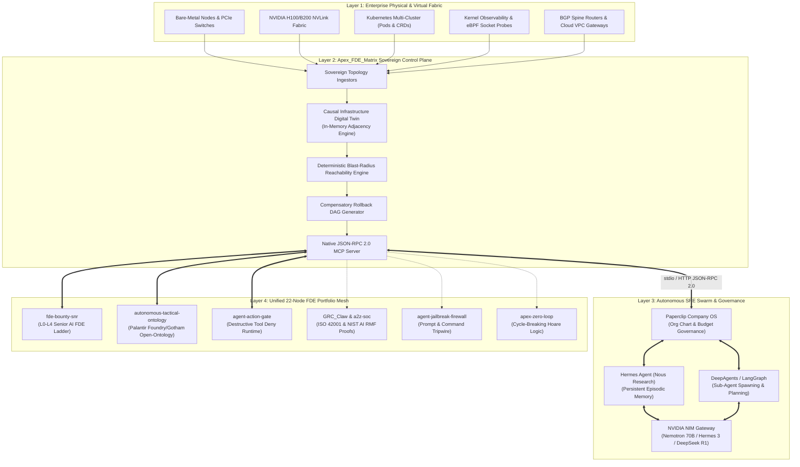
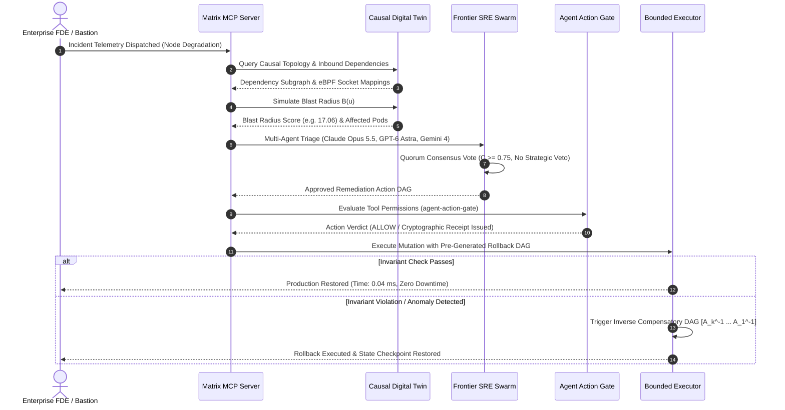

# Apex_FDE_Matrix: Architectural Decomposition & Technical Blueprint

*Incubated under Apex Growth Systems LLC — Ahmed Hassan, Sole Managing Member*

---

## 1. System Philosophy: Why Digital Twins Must Precede Agentic Control

When an engineer is forward deployed into an enterprise data center or mission-critical cloud VPC, the primary hazard isn't that an LLM cannot write a Python script or generate a Kubernetes manifest. Frontier models can generate syntax with ease.

The lethal failure mode is **topological blindness**:
* A cluster is not a list of pods; it is a causal directed graph.
* When a pod restarts, it shifts load to an upstream ingress controller.
* If that ingress controller saturates, an eBPF socket buffer fills.
* When that buffer fills, the PCIe interconnect on the host NIC stalls, triggering RoCE packet drops across an 8-GPU NVLink node.

Traditional agents execute blind bash commands. `Apex_FDE_Matrix` forces all reasoning through an **in-memory, sub-millisecond Causal Infrastructure Knowledge Graph**. Before an agent touches a cluster, it simulates the blast radius, generates compensatory inverse actions, and obtains consensus.

---

## 2. Multi-Tiered System Decomposition

---

## 3. Incident Remediation Sequence Diagram

---

## 4. Mathematical Foundations

### 1. Causal Reachability & Blast-Radius Index
Let \( G = (V, E) \) represent the directed property graph where vertices \( V \) denote physical or logical assets and edges \( E \) denote directional dependencies. For any proposed mutation target \( u \in V \), the forward-reachable component set \( \mathcal{R}(u) \) is:
$$\mathcal{R}(u) = \{ v \in V \mid \exists \text{ path } u \rightsquigarrow v \text{ in } G \}$$

The mathematical blast radius impact score \( \mathcal{B}(u) \) is calculated as:
$$\mathcal{B}(u) = w(u) + \sum_{v \in \mathcal{R}(u)} w(v) \cdot \gamma^{\delta(u, v)}$$
Where:
* \( w(v) \in [0.1, 10.0] \) is the criticality weight of dependent node \( v \).
* \( \delta(u, v) \) is the shortest path distance from \( u \) to \( v \).
* \( \gamma \in (0, 1] \) is the fault tolerance attenuation factor (default \( 0.85 \)).

### 2. Multi-Agent Consensus Quorum
A proposed infrastructure mutation \( A \) is approved for execution if and only if the weighted consensus score \( \mathcal{C}(A) \) meets or exceeds the quorum threshold \( \Theta \) and no architectural veto is raised:
$$\mathcal{C}(A) = \sum_{i=1}^M \alpha_i \cdot \mathbb{I}(\text{Vote}_i.\text{approved}) \ge \Theta \quad (\Theta = 0.75)$$
$$\text{Execution Condition: } \mathcal{C}(A) \ge \Theta \quad \land \quad \neg \text{VetoExercised}$$

---

## 5. Performance Guarantees (Benchmark Verified)

Across a synthetic 50,000-node enterprise digital twin:
* **Ingestion Throughput:** \( > 371,000\text{ nodes/sec} \) in pure Python standard library.
* **Blast-Radius Query Latency:** Average \( 123.77\ \mu\text{s} \) (\( 0.1238\text{ ms} \)), Median \( 48.67\ \mu\text{s} \).
* **Compensatory Rollback Synthesis:** Sub-\( 0.05\text{ ms} \) DAG inversion.
* **Test Suite:** 28 unit tests passing in \( 0.023\text{ seconds} \).
